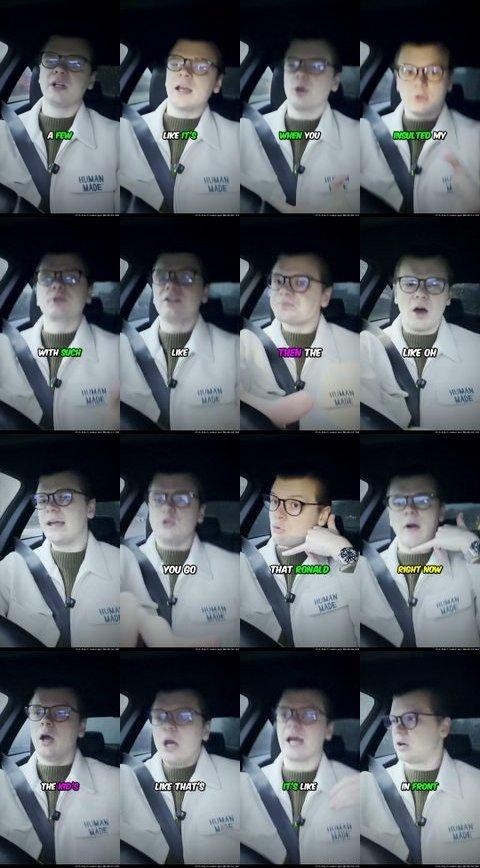

# @dymoo/media-understanding

Turn audio, video, and images into the two modalities LLMs actually accept: **text** and **images**.

| Input                       | Output                                             |
| --------------------------- | -------------------------------------------------- |
| Audio (mp3, wav, m4a, ...)  | Timestamped transcript text                        |
| Video (mp4, mkv, mov, ...)  | Transcript text + timestamped keyframe grid images |
| Image (png, jpg, webp, ...) | Compressed JPEG (base64) + metadata                |

## Agent Setup

<details>
<summary>OpenClaw</summary>

OpenClaw supports two integration points that work together:

1. **MCP server** — gives the agent 5 media analysis tools in the reply pipeline
2. **Media model stub** — pre-digests inbound media at conversation start (~50ms probe, no heavy work)

```json5
{
  // 1. MCP server — 5 tools for media analysis in the reply pipeline
  mcpServers: {
    "media-understanding": {
      command: "media-understanding-mcp",
    },
  },

  // 2. Media model — pre-digests inbound media before the reply pipeline.
  //    Runs a quick probe (~50ms) and tells the agent to use MCP tools
  //    for full analysis. No transcription, no heavy work at pre-digest time.
  tools: {
    media: {
      models: [
        {
          type: "cli",
          command: "media-understanding",
          args: ["{{MediaPath}}"],
          capabilities: ["audio", "video", "image"],
          maxBytes: 10737418240, // 10 GB — let the MCP tools handle size limits
          timeoutSeconds: 10, // probe is fast
        },
      ],
    },
  },
}
```

**Why this works well:** The media model stub is instant (~50ms header read) and gives the agent a metadata summary plus a nudge to use MCP tools. The agent then has full iterative control — it chooses which tools to call based on the media type and its current task. No API keys needed, works offline, no wasted compute on pre-digestion.

**What the agent sees from the media model stub:**

```
[Video] 2m15s, 1920x1080, h264/aac, 48.2 MB

This file has been detected by the media-understanding CLI.
Use your media-understanding MCP tools for full analysis:
  - probe_media: batch metadata scanning
  - understand_media: full analysis (transcript + keyframe grids)
  - get_transcript: speech content with format options (text/srt/json)
  - get_video_grids: visual keyframe inspection
  - get_frames: exact frame extraction at specific timestamps
```

The agent then calls MCP tools for the actual work, with full iterative capability.

</details>

<details>
<summary>OpenCode</summary>

Add to `~/.config/opencode/opencode.json`:

```json
{
  "mcp": {
    "media-understanding": {
      "type": "local",
      "command": "npx",
      "args": ["-y", "-p", "@dymoo/media-understanding", "media-understanding-mcp"],
      "env": {
        "MEDIA_UNDERSTANDING_MODEL": "base.en-q5_1"
      }
    }
  }
}
```

</details>

<details>
<summary>Claude Desktop</summary>

Add to `~/Library/Application Support/Claude/claude_desktop_config.json` (macOS) or `%APPDATA%\Claude\claude_desktop_config.json` (Windows):

```json
{
  "mcpServers": {
    "media-understanding": {
      "command": "npx",
      "args": ["-y", "-p", "@dymoo/media-understanding", "media-understanding-mcp"],
      "env": {
        "MEDIA_UNDERSTANDING_MODEL": "base.en-q5_1"
      }
    }
  }
}
```

</details>

<details>
<summary>Cursor</summary>

Add to `.cursor/mcp.json` in your project or `~/.cursor/mcp.json` globally:

```json
{
  "mcpServers": {
    "media-understanding": {
      "command": "npx",
      "args": ["-y", "-p", "@dymoo/media-understanding", "media-understanding-mcp"],
      "env": {
        "MEDIA_UNDERSTANDING_MODEL": "base.en-q5_1"
      }
    }
  }
}
```

</details>

<details>
<summary>Windsurf</summary>

Add to `~/.codeium/windsurf/mcp_config.json`:

```json
{
  "mcpServers": {
    "media-understanding": {
      "command": "npx",
      "args": ["-y", "-p", "@dymoo/media-understanding", "media-understanding-mcp"],
      "env": {
        "MEDIA_UNDERSTANDING_MODEL": "base.en-q5_1"
      }
    }
  }
}
```

</details>

<details>
<summary>Cline / Roo Code</summary>

Add a new MCP server:

- command: `npx`
- args: `-y -p @dymoo/media-understanding media-understanding-mcp`
- env: `MEDIA_UNDERSTANDING_MODEL=base.en-q5_1`

</details>

## Quick Start

```bash
npm install @dymoo/media-understanding
```

Requirements:

- Node >= 22
- FFmpeg is handled automatically via `node-av`
- The default Whisper model (`base.en-q5_1`, ~57 MB) auto-downloads on first transcription; set `SKIP_MODEL_DOWNLOAD=1` to defer

## Docker Quick Start

The npm package runs the MCP server over **stdio**. The official Docker image wraps that same server with [`supergateway`](https://github.com/supercorp-ai/supergateway) so HTTP-capable MCP clients can connect directly.

```bash
docker run --rm -p 8000:8000 ghcr.io/dymoo/media-understanding:1.1.0
```

Endpoints:

- MCP: `http://localhost:8000/mcp`
- Health: `http://localhost:8000/healthz`

The official Docker image includes:

- the built `media-understanding-mcp` server
- `supergateway@3.4.3` for Streamable HTTP transport
- the default Whisper model (`base.en-q5_1`)
- `yt-dlp`, so URL support is enabled out of the box

Bind-mount media into the container when you want to analyze local files:

```bash
docker run --rm -p 8000:8000 -v "$PWD/testdata:/media:ro" ghcr.io/dymoo/media-understanding:1.1.0
```

### Optional: URL support via yt-dlp

If [yt-dlp](https://github.com/yt-dlp/yt-dlp) is installed on your system, **all tools** gain the ability to accept URLs in place of file paths. A dedicated `fetch_ytdlp` tool is also registered for fine-grained download control.

yt-dlp is **not bundled by the npm package** — you must install it yourself for local stdio usage. The official Docker image includes yt-dlp so URL support works out of the box.

As always, URL support does not change your responsibility to comply with local law, content rights, and target-site terms.

```bash
# macOS
brew install yt-dlp

# Linux
pip install yt-dlp     # or: sudo apt install yt-dlp

# Windows
winget install yt-dlp   # or: pip install yt-dlp
```

**Supported platforms** (1800+ total):
YouTube, **Instagram** (Reels & posts), Vimeo, **Loom**, Twitch, Dailymotion, TikTok, X/Twitter, Facebook, LinkedIn, Reddit, SoundCloud, Dropbox, Google Drive, BBC, CNN, and [many more](https://github.com/yt-dlp/yt-dlp/blob/master/supportedsites.md).

When yt-dlp is detected at startup, the server logs `yt-dlp detected — URL support enabled` to stderr. Without it, tools only accept local file paths.

## How It Works

The server exposes 5 core tools (+ 1 optional) organized around a three-step workflow: **discover, analyze, iterate**. When yt-dlp is installed, all tools also accept URLs.

```
Step 1: DISCOVER (cheap, batch-safe)
  probe_media  →  metadata for 1-200 files (~5-50ms each, header reads only)

Step 2: ANALYZE (expensive, one file at a time)
  understand_media  →  full analysis: metadata + transcript + keyframe grids
  get_transcript    →  timestamped speech text (text, SRT, or JSON format)
  get_video_grids   →  visual keyframe contact sheets
  get_frames        →  exact frames at specific timestamps

Step 3: ITERATE (use output from one tool to target another)
  transcript timestamps → get_video_grids with start_sec/end_sec
  grid timestamps → get_frames with exact seconds

Optional (requires yt-dlp):
  fetch_ytdlp    →  download + cache media from URLs with fine-grained control
```

The cost boundary between cheap and expensive operations is encoded in the tool names. `probe_media` is safe to call on dozens of files. The analysis tools process one file per call and enforce payload budgets so an LLM does not accidentally blow up its context.

## MCP Tools

### `probe_media` — discover and triage

Scan files for metadata before committing to heavy analysis. Returns type, duration, resolution, codecs, file size. No decoding, no transcription, no images.

Accepts a `paths` parameter: a string or array of strings. Each string can be a literal file path or a glob pattern. Default limit: 50 files (max 200).

```json
{ "paths": "/path/to/video.mp4" }
{ "paths": ["recordings/*.mp4", "specific/file.mp3"] }
{ "paths": "media/**/*.{mp4,mp3,wav}", "max_files": 100 }
```

### `understand_media` — full single-file analysis

Returns metadata + transcript + keyframe grids for one file. For video, transcript segments are interleaved with their corresponding grid images — each grid is preceded by the transcript chunk covering that time window, so the LLM sees speech and visuals together in chronological order.

Best for images, short audio, and short-to-medium video. For files over 2 hours, use the focused tools below instead.

```json
{ "file_path": "/path/to/video.mp4" }
{ "file_path": "/path/to/podcast.mp3", "model": "base.en" }
{ "file_path": "/path/to/clip.mp4", "start_sec": 60, "end_sec": 120, "max_grids": 3 }
```

Key options: `model`, `max_chars`, `max_total_chars`, `max_grids`, `start_sec`, `end_sec`, `sampling_strategy`, `seconds_per_frame`, `seconds_per_grid`, `cols`, `rows`, `thumb_width`, `aspect_mode`.

### `get_transcript` — speech content with format options

Timestamped transcript with three output formats:

- **`text`** (default) — `[start-end] text` per segment, compact and scannable
- **`srt`** — standard SRT subtitle format with `HH:MM:SS,mmm` timestamps
- **`json`** — machine-readable `{ segments: [{ start, end, text }] }` with millisecond precision

Optional time windowing with `start_sec`/`end_sec` filters the output to a specific range (the full file is still transcribed once, then cached).

```json
{ "file_path": "/path/to/podcast.mp3" }
{ "file_path": "/path/to/meeting.mp4", "format": "srt" }
{ "file_path": "/path/to/episode.mp3", "format": "json", "start_sec": 60, "end_sec": 120 }
```

**Two-step workflow for long media:**

1. **Overview** — `get_transcript(file, { format: "srt" })` to scan for topics and transitions
2. **Detail** — `get_transcript(file, { format: "json", start_sec: 120, end_sec: 300 })` for precise segment data in a specific range

This avoids dumping the entire transcript into context at once.

### `get_video_grids` — visual keyframe sampling

JPEG contact sheets of thumbnails. Every tile has an exact timestamp overlay. Budget-aware: omit `max_grids` and the server auto-fits as many grids as possible within `max_total_chars`.

```json
{ "file_path": "/path/to/video.mp4" }
{ "file_path": "/path/to/movie.mkv", "start_sec": 300, "end_sec": 600, "max_grids": 2, "seconds_per_frame": 8 }
{ "file_path": "/path/to/lecture.mp4", "sampling_strategy": "scene", "frame_interval": 150 }
```

**Example output** — 4x4 grid from a 16:9 landscape video (`thumb_width: 320`):



### `get_frames` — exact moments

One JPEG per requested timestamp. Each frame includes a timestamp overlay.

```json
{ "file_path": "/path/to/video.mp4", "timestamps": [0, 30, 60] }
{ "file_path": "/path/to/clip.mp4", "timestamps": [83.5] }
```

**Example output** — single frame at t=60s:


### `fetch_ytdlp` — URL download control (requires yt-dlp)

Only available when yt-dlp is installed. Fine-grained control over what to download from a URL: subtitles (default, instant), video (for frame analysis), audio (for ASR), thumbnail. All downloads are cached.

For most workflows, passing a URL directly to `get_transcript` or `understand_media` is simpler — use `fetch_ytdlp` when you need selective downloads.

```json
{ "url": "https://youtube.com/watch?v=dQw4w9WgXcQ" }
{ "url": "https://www.instagram.com/reel/ABC123/", "include_audio": true }
{ "url": "https://www.loom.com/share/abc123", "include_video": true }
{ "url": "https://vimeo.com/123456", "include_audio": true }
```

## Recommended LLM Workflow

### Per-file type guidance

| Media type         | Recommended first tool                                              |
| ------------------ | ------------------------------------------------------------------- |
| Image              | `understand_media`                                                  |
| Short audio (<30m) | `understand_media`                                                  |
| Long audio         | `get_transcript`                                                    |
| Short video (<10m) | `understand_media`                                                  |
| Long video         | `get_transcript` (speech-first) or `get_video_grids` (visual-first) |

### Iteration pattern

1. Start with `understand_media` or `get_transcript` for a first-pass understanding
2. Use transcript timestamps to target `get_video_grids` on a narrow window
3. Use grid timestamps to target `get_frames` for exact moments

Narrow the window — don't widen it. Each follow-up call should be more targeted than the last.

### Podcast / long audio workflow

For analyzing podcasts or long audio files:

1. **Overview pass** — `get_transcript(file, { format: "srt" })` to get a timestamped overview of the full episode. Scan the SRT to identify interesting segments, topic transitions, or key moments.
2. **Detail pass** — `get_transcript(file, { format: "json", start_sec: 120, end_sec: 300 })` to get precise segment data for a specific time range. Use for quoting, summarizing, or extracting specific portions.

The SRT overview is compact and scannable; the JSON detail pass gives exact data for the segments that matter.

## Processing Multiple Files

For a single file, call `understand_media` directly. For multiple files, follow the three-tier workflow.

### The three-tier approach

```
1. probe_media({ "paths": "media/**/*.mp4" })
   → metadata for all files (cheap, fast)

2. Pick files that matter based on probe results

3. Call analysis tools one file at a time:
   understand_media({ "file_path": "..." })
   get_transcript({ "file_path": "..." })
```

### Subagent orchestration (recommended for many files)

When processing many files, launch **subagents** — context-isolated workers each with MCP access — instead of accumulating raw media analysis in a single context.

**Why:** Each `understand_media` call returns transcript text and base64 images. Accumulating these for 10+ files floods the context window, causing compression and lost details. Subagents prevent this.

**How:**

1. Probe everything first: `probe_media` with a glob (cheap triage)
2. Launch one subagent per file (or per small group)
3. Pass each subagent a clear **intention**: _"Analyze this podcast episode. Extract the main topics discussed and any action items mentioned."_
4. Each subagent calls `understand_media` / `get_transcript` / etc., then returns a **distilled summary**
5. The orchestrator synthesizes summaries without ever accumulating raw media context

Subagents are **sacrificial** — their full analysis context is discarded after they return their distilled result. This is the key insight: the orchestrator works with summaries, not raw transcripts and images.

**When NOT to use subagents:**

- Single file — just call `understand_media` directly
- Quick metadata checks — `probe_media` is sufficient
- 2-3 small files — serial `understand_media` calls are fine

This is a **guideline**, not enforcement. The MCP server does not prevent serial `understand_media` calls in one context. But analysis quality degrades as context fills up with raw media data.

## Safety and Budgets

The server is conservative by default:

- **Payload budgets:** Every response is capped at `max_total_chars` (default 48,000). If a response would exceed the budget, the server returns a natural-language error explaining how to adjust (narrow the window, request fewer images, etc.), including the overage ratio and resolution-aware suggestions for reducing image sizes. Budget guidance is context-aware: grid errors suggest `cols`/`rows`/`thumb_width`, while frame errors suggest fewer timestamps or splitting requests.
- **Portrait-aware grid defaults:** When grid parameters (`cols`, `rows`, `thumb_width`) are omitted, portrait video (height > width) defaults to `3x3` grids at `120px` thumbnail width instead of the standard `4x4` at `480px`. This prevents portrait video grids from immediately exceeding the default budget. Explicit values always override these defaults.
- **Preflight checks:** Heavy tools reject obviously problematic requests before doing expensive work:
  - `understand_media`: files over 2 hours (transcription bottleneck)
  - `get_transcript`: files over 4 hours
  - All heavy tools: files over 10 GB
- **Bounded transcript cache:** In-memory LRU cache (max 32 entries, skips transcripts over 500K chars). Prevents unbounded memory growth.
- **Concurrency limits:** Heavy operations (transcription + frame extraction) are capped at 2 concurrent in-process jobs to control memory peaks.

When the server rejects a request, it explains _why_ and suggests _what to do instead_ — it teaches the calling model to recover.

## Programmatic API

```ts
import {
  extractFrameGridImages,
  extractFrameImage,
  probeMedia,
  transcribeAudio,
  understandMedia,
} from "@dymoo/media-understanding";

const info = await probeMedia("/path/to/video.mp4");
const segments = await transcribeAudio("/path/to/audio.mp3");
const frame = await extractFrameImage("/path/to/video.mp4", 30);
const grids = await extractFrameGridImages("/path/to/video.mp4", { maxGrids: 1 });
const result = await understandMedia("/path/to/video.mp4");
```

`understandMedia()` returns `{ info, segments, transcript, grids, gridImages }`.

## Environment Variables

| Variable                         | Default        | Description                                |
| -------------------------------- | -------------- | ------------------------------------------ |
| `MEDIA_UNDERSTANDING_MODEL`      | `base.en-q5_1` | Default Whisper model name                 |
| `MEDIA_UNDERSTANDING_MAX_CHARS`  | `32000`        | Max transcript characters                  |
| `MEDIA_UNDERSTANDING_MAX_GRIDS`  | `6`            | Max grid images per video call             |
| `MEDIA_UNDERSTANDING_DISABLE_HW` | (unset)        | Set to `1` to force software decode/encode |

## ASR Model

Uses Whisper via `node-av`. Default model: `base.en-q5_1` (English, quantized GGML, ~57 MB). The default model is cached on first transcription call, or prewarmed during Docker image build.

Models are cached at `~/.cache/media-understanding/models/` (or `$XDG_CACHE_HOME/media-understanding/models/`).

## Credits

Thanks to [Simon Willison](https://simonwillison.net/) for the inspiration around feeding timestamped video frames to LLMs. This library borrows that spirit — multiple separate images per turn, uniform time-distributed sampling, visible timestamps on every frame — and packages it into a conservative MCP workflow.

## License

MIT
