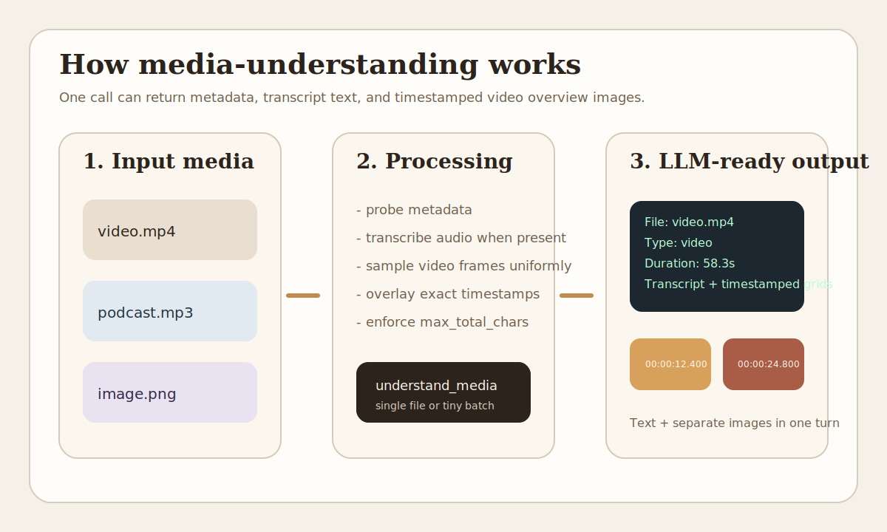
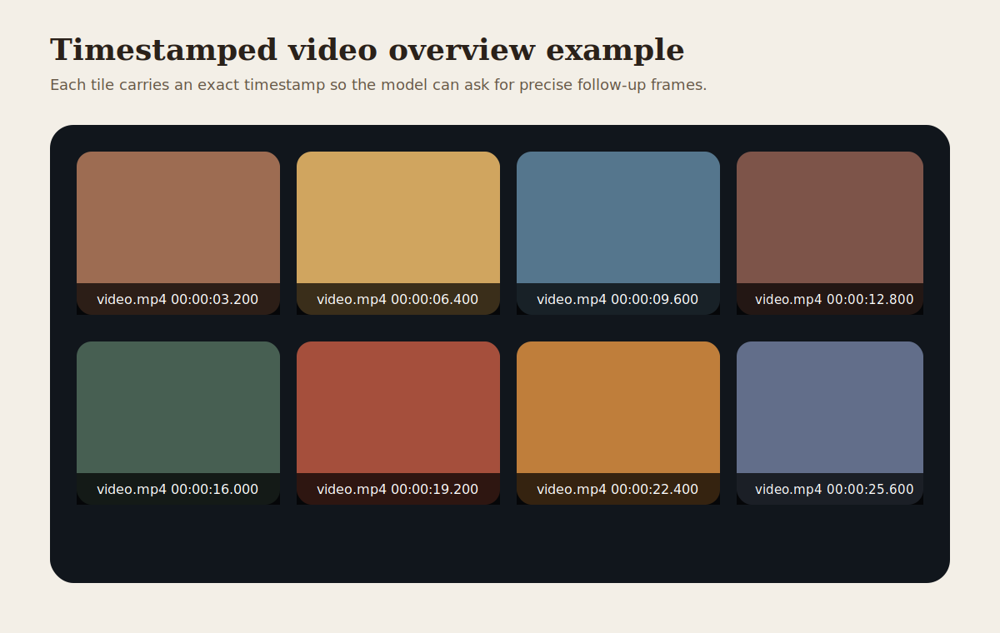
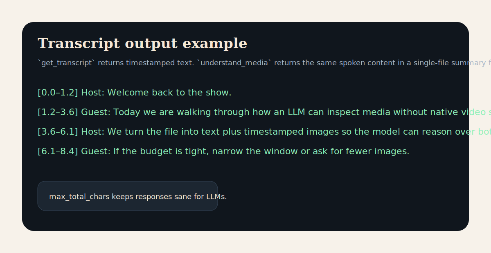

# @dymoo/media-understanding

Turn audio, video, and images into the two modalities LLMs actually accept well: text and images.

| Input                     | Output                                             |
| ------------------------- | -------------------------------------------------- |
| Audio (mp3, wav, m4a, …)  | Transcript text                                    |
| Video (mp4, mkv, mov, …)  | Transcript text + timestamped overview/grid images |
| Image (png, jpg, webp, …) | Compressed JPEG (base64) + metadata                |

## Quick Start

```bash
npm install @dymoo/media-understanding
```

Requirements:

- Node >= 20
- FFmpeg is handled via `node-av`
- the default Whisper model (`base.en-q5_1`) is pre-warmed on install unless you set `SKIP_MODEL_DOWNLOAD=1`

First useful call for a single video:

```json
{
  "file_path": "/path/to/video.mp4",
  "max_total_chars": 32000
}
```

That returns:

- metadata
- transcript text
- timestamped video overview images
- a strict payload cap so an LLM does not accidentally explode context

## How It Works

The package is designed for conservative agent usage:

1. inspect a single file, or a very small batch
2. get a compact first-pass understanding
3. zoom in only when needed with transcript-only, grid-only, or exact-frame calls



### What the model sees

#### Video overview

Each returned grid tile carries an exact timestamp overlay so the model can ask for precise follow-up frames.



#### Transcript output

Transcript-first flows stay lightweight and timestamped.



### Example MCP flow

Single short video:

```json
{
  "tool": "understand_media",
  "arguments": {
    "file_path": "/path/to/video.mp4",
    "max_total_chars": 32000
  }
}
```

Typical response shape:

```text
File: /path/to/video.mp4
Type: video
Duration: 58.3s
Resolution: 1920x1080
Video sampling: 1 grid image(s), each tile has an exact timestamp overlay.

--- TRANSCRIPT ---
We open on a hallway...

--- FRAME GRID 1/1 ---
Grid 1/1 covers 0.000s-24.000s. Tile timestamps: 00:00:03.000, 00:00:06.000, ...

Payload: 28741 chars total, 23180 base64 image chars.
```

Long video, spoken-content first:

```json
{
  "tool": "get_transcript",
  "arguments": {
    "file_path": "/path/to/podcast.mp3",
    "max_chars": 16000
  }
}
```

Then narrow back to visuals if needed:

```json
{
  "tool": "get_video_grids",
  "arguments": {
    "file_path": "/path/to/video.mp4",
    "start_sec": 300,
    "end_sec": 420,
    "seconds_per_frame": 8,
    "max_total_chars": 32000
  }
}
```

Need an exact moment?

```json
{
  "tool": "get_frames",
  "arguments": {
    "file_path": "/path/to/video.mp4",
    "timestamps": [83.5],
    "max_total_chars": 32000
  }
}
```

## Recommended LLM Workflow

Keep it conservative.

### Single file

- image -> `understand_media`
- audio -> `get_transcript` first if timestamps matter, otherwise `understand_media`
- short/medium video -> `understand_media`
- long video -> `get_transcript` first when speech matters most, otherwise `get_video_grids`

### Small batch

Use `understand_media` with either `file_paths` or a narrow `glob`, but only for a very small shortlist pass.

```json
{
  "file_paths": ["clip.mp4", "episode.mp3"],
  "max_files": 2,
  "batch_concurrency": 2,
  "max_total_chars": 32000
}
```

Why the API is strict:

- broad batches get rejected on purpose
- concurrency is clamped low on purpose
- payloads are capped on purpose

This prevents a model from bulk-loading huge media sets and blowing up memory or context.

## MCP Tools

### `understand_media`

First-pass tool for a single file or a tiny conservative batch.

Supports exactly one of:

- `file_path`
- `file_paths`
- `glob`

Useful options:

- `max_total_chars`
- `max_chars`
- `max_grids`
- `seconds_per_frame`
- `seconds_per_grid`
- `sampling_strategy`
- `aspect_mode`
- `max_files`
- `batch_concurrency`

Examples:

```json
{ "file_path": "/path/to/video.mp4" }
{ "file_paths": ["clip.mp4", "podcast.mp3"] }
{ "glob": "media/*.{mp4,png}", "max_files": 2 }
{ "file_path": "/path/to/clip.mp4", "start_sec": 60, "end_sec": 120, "max_grids": 2, "seconds_per_frame": 6, "seconds_per_grid": 30 }
```

### `get_video_grids`

Visual-only drill-down for videos. Every tile has an exact timestamp overlay and the response text lists tile timestamps.

```json
{ "file_path": "/path/to/movie.mkv", "max_grids": 2, "seconds_per_frame": 8 }
{ "file_path": "/path/to/lecture.mp4", "sampling_strategy": "scene", "frame_interval": 150 }
```

### `get_frames`

Exact frames for exact timestamps.

```json
{ "file_path": "/path/to/video.mp4", "timestamps": [0, 30, 60] }
{ "file_path": "/path/to/clip.mp4", "timestamps": [83.5] }
```

### `get_transcript`

Timestamped transcript text only.

```json
{ "file_path": "/path/to/podcast.mp3" }
{ "file_path": "/path/to/meeting.mp4", "model": "base.en-q5_1", "max_chars": 16000 }
```

## Agent Setup

<details>
<summary>OpenCode</summary>

Add to `~/.config/opencode/opencode.json`:

```json
{
  "mcp": {
    "media-understanding": {
      "type": "local",
      "command": "npx",
      "args": ["-y", "@dymoo/media-understanding/mcp"],
      "env": {
        "MEDIA_UNDERSTANDING_MODEL": "base.en-q5_1"
      }
    }
  }
}
```

</details>

<details>
<summary>Claude Desktop</summary>

Add to `~/Library/Application Support/Claude/claude_desktop_config.json` on macOS or `%APPDATA%\Claude\claude_desktop_config.json` on Windows:

```json
{
  "mcpServers": {
    "media-understanding": {
      "command": "npx",
      "args": ["-y", "@dymoo/media-understanding/mcp"],
      "env": {
        "MEDIA_UNDERSTANDING_MODEL": "base.en-q5_1"
      }
    }
  }
}
```

</details>

<details>
<summary>Cursor</summary>

Add to `.cursor/mcp.json` in your project or `~/.cursor/mcp.json` globally:

```json
{
  "mcpServers": {
    "media-understanding": {
      "command": "npx",
      "args": ["-y", "@dymoo/media-understanding/mcp"],
      "env": {
        "MEDIA_UNDERSTANDING_MODEL": "base.en-q5_1"
      }
    }
  }
}
```

</details>

<details>
<summary>Windsurf</summary>

Add to `~/.codeium/windsurf/mcp_config.json`:

```json
{
  "mcpServers": {
    "media-understanding": {
      "command": "npx",
      "args": ["-y", "@dymoo/media-understanding/mcp"],
      "env": {
        "MEDIA_UNDERSTANDING_MODEL": "base.en-q5_1"
      }
    }
  }
}
```

</details>

<details>
<summary>Cline / Roo Code</summary>

Add a new MCP server:

- command: `npx`
- args: `-y @dymoo/media-understanding/mcp`
- env: `MEDIA_UNDERSTANDING_MODEL=base.en-q5_1`

</details>

## CLI

```bash
media-understanding <file> [options]

Options:
  -m, --model <name>      Whisper model (default: base.en-q5_1)
  --max-chars <n>         Max transcript characters (default: 32000)
  -h, --help              Show help
```

## Environment Variables

| Variable                        | Default        | Description                    |
| ------------------------------- | -------------- | ------------------------------ |
| `MEDIA_UNDERSTANDING_MODEL`     | `base.en-q5_1` | Whisper model name             |
| `MEDIA_UNDERSTANDING_MAX_CHARS` | `32000`        | Max transcript characters      |
| `MEDIA_UNDERSTANDING_MAX_GRIDS` | `6`            | Max grid images per video call |

## Whisper Models

Default: `base.en-q5_1` (~57 MB, quantized). Models are cached at `~/.cache/media-understanding/models`.

Standard models: `tiny`, `tiny.en`, `base`, `base.en`, `small`, `small.en`, `medium`, `medium.en`, `large-v1`, `large-v2`, `large-v3`

Quantized models: `tiny.en-q5_1`, `base.en-q5_1`, `small.en-q5_1`, `large-v3-turbo-q5_0`

## Programmatic API

```ts
import {
  extractFrameGridImages,
  extractFrameImage,
  probeMedia,
  transcribeAudio,
  understandMedia,
} from "@dymoo/media-understanding";

const info = await probeMedia("/path/to/video.mp4");
const segments = await transcribeAudio("/path/to/audio.mp3");
const frame = await extractFrameImage("/path/to/video.mp4", 30);
const grids = await extractFrameGridImages("/path/to/video.mp4", { maxGrids: 1 });
const result = await understandMedia("/path/to/video.mp4");
```

`understandMedia()` now returns both `grids` and richer `gridImages` metadata.

## Notes

- Responses are intentionally capped so the LLM does not accidentally nuke its context window.
- Batch mode is intentionally conservative.
- If you ask for too much, the server returns natural-language errors telling the model how to recover.

Thanks to Simon Willison for the inspiration around feeding timestamped video frames to LLMs. This library borrows that spirit while packaging it into a conservative MCP/server workflow.

## License

MIT
